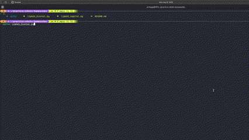

# practica-robots-humanoides

## Avance en el plano **frontal**
Para simular el avance del robot en el plano frontal he usado el archivo **limp2d_frontal**.
Dentro de este archivo se han modificado las siguientes sentencias para simular de manera correcta el balanceo:
```python
# linea 18 
HEIGHT = 0.2 * len("santillan")

# linea 29
ax.set_ylim(-0.1, 2)

# linea 41
self.zmp_y = [100, 300, 100, 300, 100, 300, 100, 300, 100]

# linea 42
k = 5

# linea 43
self.zmp_time_change = [
    24,
    29,
    31 + k,
    31 + k * 2,
    31 + k * 3,
    31 + k * 4,
    31 + k * 5,
    31 + k * 6,
    31 + k * 7,
]
```

Modificando estas sentencias conseguimos el siguiente resultado:




## Avance en el plano **sagital**
Para simular el avance del robot en el plano sagital he usado el archivo **limp2d_sagital**.
Dentro de este archivo se han modificado las siguientes sentencias para simular de manera correcta la caminata:
```python
# linea 18
HEIGHT = 0.2 * len("santillan")

# linea 28
ax.set_ylim(-0.1, 2)

# lineas 38 y 39
self.zmp_x = [0, 200, 400, 600, 800, 1000, 1200, 1400]
self.zmp_x_change = [100, 300, 500, 700, 900, 1100, 1300]
```

Modificando estas sentencias conseguimos el siguiente resultado:


## EXTRA PEQUEÑO: gravedades
Se ha añadido una función que te pregunta que **gravedad** quieres usar para la simulación:
```python
def askGravity():
    print("###### Elije la gravedad que quieres experimentar ######\n")
    print(
        "Mercurio: 2.78 m/s2\nVenus: 8.87 m/s2\nTierra: 9.81 m/s2\nLuna: 1.62 m/s2\nMarte: 3.72 m/s2\nJupiter: 22.88 m/s2\nSaturno: 9.05 m/s2\nUrano: 7.77 m/s2\nNeptuno: 11 m/s2"
    )
    planeta = input("Indica el nombre del planeta: ")
    match planeta:
        case "Mercurio":
            return 2.78
        case "Venus":
            return 8.87
        case "Tierra":
            return 9.81
        case "Luna":
            return 1.62
        case "Marte":
            return 3.72
        case "Jupiter":
            return 22.88
        case "Saturno":
            return 9.05
        case "Urano":
            return 7.77
        case "Neptuno":
            return 11
        case _:
            print("Introduce un planeta valido...")
```

El resultado de usar otra gravedad en el plano sagital es el siguiente:


## EXTRA GRANDE: visualización 3D
Se ha modificado el código de limp2d_sagital para que se muestre la simulación en **3 dimensiones**.

```python
class Simulator:
    def __init__(self):
        self.zmp_x = [0, 200, 400, 600, 800, 1000, 1200, 1400]
        self.zmp_y = [0, 200, 400, 600, 800, 1000, 1200, 1400]
        self.zmp_x_change = [100, 300, 500, 700, 900, 1100, 1300]
        self.zmp_y_change = [100, 300, 500, 700, 900, 1100, 1300]
        self.zmp_idx = 0
        self.c_x = self.zmp_x[0] + 0.1  # para que arranque
        self.c_y = self.zmp_y[0] + 0.1  # para que arranque
        self.c_x_dot = 0
        self.c_y_dot = 0

    def __call__(self):
        x_dot2 = G / HEIGHT * (self.c_x - self.zmp_x[self.zmp_idx])
        y_dot2 = G / HEIGHT * (self.c_y - self.zmp_y[self.zmp_idx])
        self.c_x += self.c_x_dot * TIME_DELTA
        self.c_y += self.c_y_dot * TIME_DELTA
        self.c_x_dot += x_dot2 * TIME_DELTA
        self.c_y_dot += y_dot2 * TIME_DELTA

        ln.set_data(
            [self.zmp_x[self.zmp_idx], self.c_x], [self.zmp_y[self.zmp_idx], self.c_y]
        )
        ln.set_3d_properties([0, HEIGHT])

        if (
            self.c_x > self.zmp_x_change[self.zmp_idx]
            or self.c_y > self.zmp_y_change[self.zmp_idx]
        ):
            self.zmp_idx += 1

        if self.c_x > MAX_X or self.c_y > MAX_X:
            quit()

        return (ln,)
```

El resultado de la simulación en 3 dimensiones es el siguiente:


## EXTRA PEQUEÑO: pendulo de altura variable
Se ha modificado el código de limp2d_sagital para que el péndulo cambie su altura en cada paso:
```python
class Simulator:
    def __init__(self):
        self.zmp_x = [0, 200, 400, 600, 800, 1000, 1200, 1400]
        self.zmp_y = [0, 200, 400, 600, 800, 1000, 1200, 1400]
        # Modifica las alturas de los puntos en el eje Z
        self.zmp_z = [1, 1.5, 1, 1.5, 1, 1.5, 1, 1.5]
        self.zmp_x_change = [100, 300, 500, 700, 900, 1100, 1300]
        self.zmp_y_change = [100, 300, 500, 700, 900, 1100, 1300]
        self.zmp_idx = 0
        self.c_x = self.zmp_x[0] + 0.1  # para que arranque
        self.c_y = self.zmp_y[0] + 0.1  # para que arranque
        self.c_z = self.zmp_z[0]  # para que arranque
        self.c_x_dot = 0
        self.c_y_dot = 0
        self.aux = 100

    def __call__(self):
        x_dot2 = G / HEIGHT * (self.c_x - self.zmp_x[self.zmp_idx])
        y_dot2 = G / HEIGHT * (self.c_y - self.zmp_y[self.zmp_idx])

        # Incrementa la coordenada Z solo cuando el eje X cambie
        if self.aux < self.zmp_x_change[self.zmp_idx]:
            self.c_z = self.zmp_z[self.zmp_idx]
            self.aux = self.zmp_x_change[self.zmp_idx]

        self.c_x += self.c_x_dot * TIME_DELTA
        self.c_y += self.c_y_dot * TIME_DELTA
        self.c_x_dot += x_dot2 * TIME_DELTA
        self.c_y_dot += y_dot2 * TIME_DELTA

        ln.set_data(
            [self.zmp_x[self.zmp_idx], self.c_x], [self.zmp_y[self.zmp_idx], self.c_y]
        )
        ln.set_3d_properties([0, self.c_z])

        if (
            self.c_x > self.zmp_x_change[self.zmp_idx]
            or self.c_y > self.zmp_y_change[self.zmp_idx]
        ):
            self.zmp_idx += 1

        if self.c_x > MAX_X or self.c_y > MAX_X:
            quit()

        return (ln,)
```
El resultado es el siguiente:


